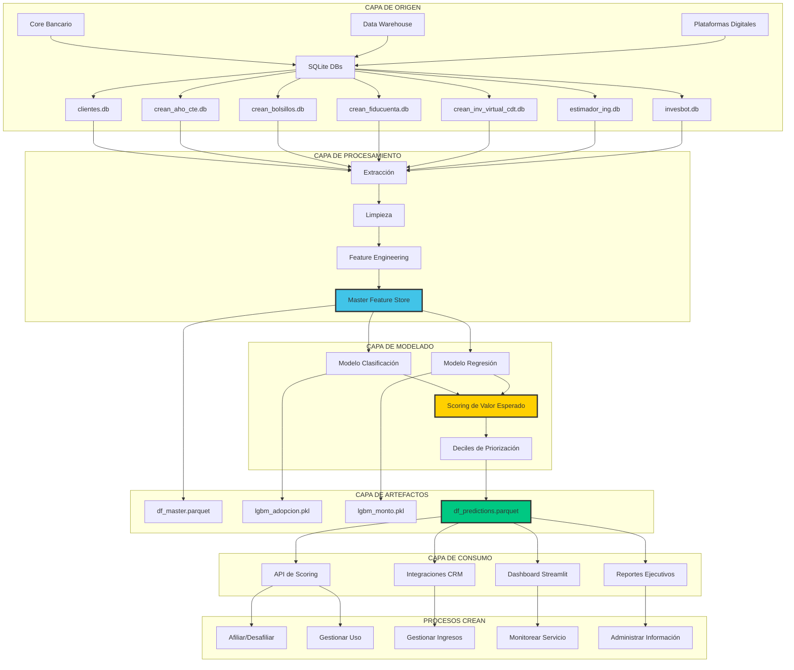

# Modelo Operacional y Arquitectura de Integración CREAN
## Solución Analítica para App de Inversiones

---

## 1. Modelo Conceptual de la Solución

### 1.1 Visión General

La solución analítica para la App de Inversiones CREAN opera como un **motor de inteligencia comercial** que alimenta decisiones de negocio en múltiples procesos del ecosistema CREAN. Su función principal es **identificar, cuantificar y priorizar** oportunidades de adopción del nuevo producto.

```
┌─────────────────────────────────────────────────────────────────────┐
│                    MOTOR DE INTELIGENCIA COMERCIAL                  │
│                     (Solución Analítica CREAN)                      │
├─────────────────────────────────────────────────────────────────────┤
│                                                                     │
│  INPUT                    PROCESAMIENTO               OUTPUT        │
│  ─────                    ─────────────               ──────        │
│                                                                     │
│  • Datos                  • Limpieza                 • Scoring      │
│    financieros            • Feature Eng.               por cliente  │
│  • Datos                  • Modelado ML              • Segmentos    │
│    demográficos           • Predicción                 prioritarios │
│  • Datos                  • Priorización             • KPIs de      │
│    transaccionales                                     negocio      │
│                                                       • Dashboards  │
│                                                                     │
└─────────────────────────────────────────────────────────────────────┘
         ▲                                                   │
         │                                                   │
         │  Actualización periódica                          │ Consumo
         │  (Mensual/Trimestral)                             │ continuo
         │                                                   │
         │                                                   ▼
┌─────────────────────────┐                    ┌─────────────────────┐
│   SISTEMAS DE ORIGEN    │                    │  PROCESOS DE CREAN  │
│   ───────────────────   │                    │  ─────────────────  │
│   • Core Bancario       │                    │  • Afiliación       │
│   • Data Warehouse      │                    │  • Gestión de uso   │
│   • CRM                 │                    │  • Monitoreo        │
│   • Plataformas         │                    │  • Info Management  │
│     digitales           │                    │  • Revenue Mgmt     │
└─────────────────────────┘                    └─────────────────────┘
```

---

## 2. Arquitectura de Flujo de Datos

### 2.1 Diagrama de Arquitectura End-to-End



---

### 2.2 Flujo de Información Detallado

#### Etapa 1: Extracción de Fuentes
**Responsable:** Pipeline automatizado ([extraction.py](../src/data_processing/extraction.py))

**Inputs:**
- 7 bases de datos SQLite (.db) desde sistemas de origen
- Frecuencia: Mensual (actualización programada)

**Proceso:**
1. Conexión a cada archivo `.db`
2. Detección dinámica de tabla interna
3. Carga completa a DataFrames en memoria
4. Validación de esquema esperado (columnas requeridas)

**Outputs:**
- Diccionario de DataFrames en memoria (6.6M registros agregados)

**Validación de calidad:**
- ✓ Columna `numero_id` presente en todas las tablas
- ✓ Cantidad de registros esperada (≈1M por tabla transaccional)
- ✓ Tipos de datos consistentes

---

#### Etapa 2: Limpieza de Datos
**Responsable:** Pipeline automatizado ([cleaning.py](../src/data_processing/cleaning.py))

**Inputs:**
- DataFrames crudos desde Etapa 1

**Proceso:**
1. Eliminación de duplicados exactos en `clientes` (8 filas)
2. Imputación de ingresos desde `estimador_ing` (176 rescatados)
3. Imputación residual a 0 con bandera `flag_sin_info_financiera`
4. Recalculo de `total_patrimonio = activos - pasivos`
5. Descarte de registros con saldos negativos en cuentas de ahorro/corriente (1,470 filas)
6. Imputación categórica (`desc_genero` → "NO_REGISTRADO")

**Outputs:**
- Diccionario de DataFrames limpios (6.6M registros, 0 nulos)

**Validación de calidad:**
- ✓ Total de nulos = 0 en todas las tablas
- ✓ Cardinalidad de clientes = 860,223 (consistente)
- ✓ Saldos negativos = 0 en productos críticos

---

#### Etapa 3: Feature Engineering
**Responsable:** Pipeline automatizado ([feature_engineering.py](../src/data_processing/feature_engineering.py))

**Inputs:**
- DataFrames limpios desde Etapa 2

**Proceso:**
1. Agregación de métricas por producto (saldo promedio, máximo, cantidad)
2. Construcción de ratios financieros (apalancamiento, cobertura, liquidez)
3. Generación de banderas comportamentales (superávit, propensión digital)
4. Consolidación mediante `LEFT JOIN` desde `clientes`
5. Imputación post-join (productos no contratados → 0)
6. Cálculo de targets de negocio (`target_adopcion`, `target_monto_12m`)

**Outputs:**
- Master Feature Store: `df_master.parquet` (860,223 filas × 35 columnas)

**Validación de calidad:**
- ✓ Cardinalidad = 860,223 (1 fila por cliente)
- ✓ Total de nulos = 0
- ✓ Esquema completo con 35 columnas esperadas

---

#### Etapa 4: Entrenamiento de Modelos
**Responsable:** Pipeline automatizado ([train.py](../src/models/train.py))

**Inputs:**
- Master Feature Store (`df_master.parquet`)

**Proceso:**
1. Split train/test (80/20) para evaluación
2. Entrenamiento de clasificador LightGBM (adopción)
3. Entrenamiento de regresor LightGBM condicionado (monto)
4. Evaluación de métricas (ROC-AUC, MAE, RMSE, R²)
5. Reentrenamiento sobre 100% del universo para producción
6. Serialización de modelos finales (`.pkl`)

**Outputs:**
- `models/lgbm_adopcion.pkl`
- `models/lgbm_monto.pkl`
- Métricas de evaluación (logs)

**Validación de calidad:**
- ✓ ROC-AUC test ≥ 0.85 (obtenido: 0.91)
- ✓ R² test ≥ 0.25 (obtenido: 0.33)
- ✓ Consistencia train-test (no overfitting)

---

#### Etapa 5: Scoring Productivo
**Responsable:** Pipeline automatizado ([train.py](../src/models/train.py))

**Inputs:**
- Modelos finales reentrenados
- Master Feature Store completo

**Proceso:**
1. Inferencia de probabilidad de adopción (clasificador)
2. Inferencia de monto potencial (regresor)
3. Cálculo de valor esperado: `EV = proba × monto`
4. Asignación de deciles de priorización (basados en EV)
5. Generación de dataset de predicciones

**Outputs:**
- `data/scores/df_predictions.parquet` (860,223 filas)
  - Columnas: `numero_id`, `proba_adopcion`, `monto_predicho_12m`, `valor_esperado`, `decil_priorizacion`

**Validación de calidad:**
- ✓ Probabilidades en rango [0, 1]
- ✓ Montos predichos ≥ 0
- ✓ Deciles balanceados (≈86,022 clientes por decil)

---

### 2.3 Frecuencia de Actualización Recomendada

| Componente | Frecuencia | Justificación |
|------------|------------|---------------|
| **Extracción de datos** | Mensual | Datos financieros actualizados mensualmente |
| **Limpieza y Feature Eng.** | Mensual | Sincronizado con extracción |
| **Reentrenamiento de modelos** | Trimestral | Balance entre drift y estabilidad |
| **Scoring productivo** | Mensual | Priorización actualizada para campañas |
| **Dashboard** | Tiempo real | Lectura desde `df_predictions.parquet` |

---

## 3. Integración con Procesos CREAN

### 3.1 Mapa de Procesos y Puntos de Integración

```
┌─────────────────────────────────────────────────────────────────────┐
│                        PROCESOS CREAN                               │
└─────────────────────────────────────────────────────────────────────┘

┌──────────────────────────────────────────────────────────────┐
│ 1. AFILIAR / DESAFILIAR AL SERVICIO                          │
├──────────────────────────────────────────────────────────────┤ 
│ ✓ Integración: API de Scoring                                │
│ ✓ Consumo: Priorización de outreach para afiliación          │
│ ✓ Decisión: ¿A qué clientes contactar primero?               │
│   → Deciles 10-9: Contacto ejecutivo personalizado           │
│   → Deciles 8-7: Campaña digital segmentada                  │
│   → Deciles ≤6: Campaña masiva de bajo costo                 │
│ ✓ Feedback loop: Capturar tasa de conversión real por decil  │
└──────────────────────────────────────────────────────────────┘

┌──────────────────────────────────────────────────────────────┐
│ 2. GESTIONAR EL USO DEL SERVICIO                             │
├──────────────────────────────────────────────────────────────┤
│ ✓ Integración: Enriquecimiento de perfil de cliente          │
│ ✓ Consumo: Personalización de recomendaciones in-app         │
│ ✓ Decisión: ¿Qué productos de inversión recomendar?          │
│   → Decil 10: Portafolios agresivos de alto rendimiento      │
│   → Deciles 8-9: Portafolios balanceados                     │
│   → Deciles ≤7: Portafolios conservadores / educativos       │
│ ✓ Feedback loop: Capturar preferencias reales de producto    │
└──────────────────────────────────────────────────────────────┘

┌──────────────────────────────────────────────────────────────┐
│ 3. GESTIONAR INGRESOS Y GASTOS                               │
├──────────────────────────────────────────────────────────────┤
│ ✓ Integración: Proyección de ingresos por comisiones         │
│ ✓ Consumo: Dimensionamiento de revenue esperado              │
│ ✓ Decisión: ¿Cuál es el ingreso esperado por segmento?       │
│   → Comisión promedio = 0.8% anual sobre AUM                 │
│   → Ingreso esperado Decil 10 = $25.7B anuales               │
│   → Total proyectado = $29.7B anuales                        │
│ ✓ Feedback loop: Ajustar proyecciones con AUM real           │
└──────────────────────────────────────────────────────────────┘

┌──────────────────────────────────────────────────────────────┐
│ 4. ADMINISTRAR INFORMACIÓN                                   │
├──────────────────────────────────────────────────────────────┤
│ ✓ Integración: Alimentación de Data Warehouse                │
│ ✓ Consumo: Enriquecimiento de perfil 360 del cliente         │
│ ✓ Decisión: ¿Qué información adicional capturar?             │
│   → Captura de perfil de riesgo en onboarding                │
│   → Tracking de interacciones con contenido educativo        │
│   → Logging de decisiones de inversión                       │
│ ✓ Feedback loop: Alimentar modelos futuros con nueva info    │
└──────────────────────────────────────────────────────────────┘

┌──────────────────────────────────────────────────────────────┐
│ 5. MONITOREAR EL SERVICIO                                    │
├──────────────────────────────────────────────────────────────┤
│ ✓ Integración: Dashboard ejecutivo (Streamlit)               │
│ ✓ Consumo: KPIs de adopción, AUM y conversión                │
│ ✓ Decisión: ¿El servicio está cumpliendo expectativas?       │
│   → Monitoreo de tasa de conversión real vs. predicha        │
│   → Alertas de drift en modelo (precisión < threshold)       │
│   → Tracking de NPS y satisfacción por segmento              │
│ ✓ Feedback loop: Trigger de reentrenamiento si drift > 10%   │
└──────────────────────────────────────────────────────────────┘

┌──────────────────────────────────────────────────────────────┐
│ 6. ADMINISTRAR EL SERVICIO                                   │
├──────────────────────────────────────────────────────────────┤
│ ✓ Integración: API de requerimientos y parámetros            │
│ ✓ Consumo: Configuración de reglas de negocio                │
│ ✓ Decisión: ¿Qué parámetros operativos ajustar?              │
│   → Threshold de scoring para outreach automático            │
│   → Monto mínimo de inversión por segmento                   │
│   → Configuración de comisiones diferenciadas                │
│ ✓ Feedback loop: Ajuste de parámetros basado en resultados   │
└──────────────────────────────────────────────────────────────┘

┌──────────────────────────────────────────────────────────────┐
│ 7. CONCILIAR TRANSACCIONES Y CONTABILIDAD                    │
├──────────────────────────────────────────────────────────────┤
│ ✓ Integración: Trazabilidad de origen de cliente             │
│ ✓ Consumo: Atribución de revenue a campaña de origen         │
│ ✓ Decisión: ¿Qué canal/campaña generó más valor?             │
│   → Atribución de AUM a decil de origen                      │
│   → ROI por segmento de priorización                         │
│   → Coste de adquisición (CAC) por decil                     │
│ ✓ Feedback loop: Optimizar asignación de presupuesto         │
└──────────────────────────────────────────────────────────────┘
```

---

### 3.2 Puntos de Decisión Críticos

#### Decisión 1: ¿A quién contactar primero?
**Pregunta de negocio:** ¿En qué orden priorizar el outreach comercial?

**Input de la solución:**
- `decil_priorizacion` (1-10)
- `valor_esperado` por cliente

**Regla de decisión:**
```
IF decil_priorizacion IN (10, 9):
    → Contacto ejecutivo personalizado (costo alto, conversión alta)
ELIF decil_priorizacion IN (8, 7):
    → Campaña digital segmentada (costo medio, conversión media)
ELSE:
    → Campaña masiva genérica (costo bajo, conversión baja)
```

**Medición de éxito:**
- Tasa de conversión real ≥ 35% en Decil 10
- ROI de campaña = (Revenue generado - Costo campaña) / Costo campaña

---

#### Decisión 2: ¿Qué producto recomendar a cada cliente?
**Pregunta de negocio:** ¿Cómo personalizar la oferta de inversión?

**Input de la solución:**
- `proba_adopcion` (proxy de sofisticación financiera)
- `monto_predicho_12m` (capacidad de inversión)
- Features de perfil: `total_patrimonio`, `margen_libre_estimado`, `flag_propension_digital_previa`

**Regla de decisión:**
```
IF proba_adopcion > 0.8 AND monto_predicho_12m > $50M:
    → Portafolio agresivo (acciones, fondos alternativos)
ELIF proba_adopcion > 0.5 AND monto_predicho_12m > $10M:
    → Portafolio balanceado (mixto renta fija/variable)
ELSE:
    → Portafolio conservador (CDT digital, fondos de liquidez)
```

**Medición de éxito:**
- % de clientes que completan inversión después de recomendación
- Tasa de retiro anticipado (churn) por tipo de portafolio

---

#### Decisión 3: ¿Cuándo reentrenar los modelos?
**Pregunta de negocio:** ¿El modelo sigue siendo preciso o hay drift?

**Input de la solución:**
- Tasa de conversión real vs. predicha (por decil, por mes)
- Métricas de error: MAE, RMSE en ventana móvil de 3 meses

**Regla de decisión:**
```
IF (tasa_conversión_real / tasa_conversión_predicha) NOT IN [0.85, 1.15]:
    → ALERTA: Drift detectado
    → Acción: Reentrenamiento urgente
ELIF han_pasado > 90 días desde último entrenamiento:
    → Reentrenamiento programado
```

**Medición de éxito:**
- Drift < 10% en ventana de 3 meses
- ROC-AUC post-reentrenamiento ≥ ROC-AUC baseline

---

## 4. Esquema de Operación MLOps

### 4.1 Ciclo de Vida del Modelo en Producción

```
┌───────────────────────────────────────────────────────────────┐
│                  CICLO DE VIDA MLOPS                          │
└───────────────────────────────────────────────────────────────┘

1. DESARROLLO                  2. VALIDACIÓN               3. DEPLOY
   (Data Science)                 (QA + Compliance)           (MLOps)
   ──────────────                 ─────────────────           ────────
   • EDA                          • Validación de            • Serialización
   • Feature Eng.                   métricas (ROC-AUC        • Versionado Git
   • Train/Test                     > 0.85, R² > 0.25)      • Deploy a repo
   • Tuning                       • Auditoría de             • Documentación
   • Documentación                  sesgos                    de artefactos

            ↓                              ↓                        ↓

4. MONITOREO                  5. REENTRENAMIENTO          6. GOBIERNO
   (MLOps + Analytics)           (Data Science)              (Compliance)
   ───────────────               ──────────────              ──────────
   • Drift detection             • Trigger: Drift >          • Registro de
   • Performance tracking          10% o 90 días              cambios
   • A/B testing                 • Repetir ciclo 1-3         • Auditoría de
   • Alertas                     • Validar mejora            decisiones
                                   vs. baseline              • GDPR compliance
```

---

## 5. Métricas de Éxito Operacional

### 5.1 Indicadores Técnicos (MLOps)

| Métrica | Target | Frecuencia de Medición |
|---------|--------|------------------------|
| **Uptime del pipeline** | ≥ 99.5% | Diaria |
| **Latencia de scoring** | < 5 segundos por cliente | Por ejecución |
| **Drift de modelo (AUC)** | < 10% vs. baseline | Mensual |
| **Calidad de datos (nulos)** | 0 nulos post-limpieza | Por ejecución |
| **Tiempo de ejecución pipeline** | < 25 minutos | Por ejecución |

---

### 5.2 Indicadores de Negocio (Alineados con Procesos CREAN)

| Proceso CREAN | Métrica de Impacto | Target | Medición |
|---------------|-------------------|--------|----------|
| **Afiliación** | Tasa de conversión Decil 10 | ≥ 35% | Mensual |
| **Gestión de uso** | % clientes activos post-adopción | ≥ 80% | Trimestral |
| **Ingresos** | Revenue real vs. proyectado | ±15% | Trimestral |
| **Monitoreo** | NPS del servicio | ≥ 60 | Mensual |
| **Administración** | Tiempo de resolución de incidencias | < 24h | Continuo |

---

**Documento generado con ayuda de IA:** 2026-08-08  
**Responsable:** LDC Analítica CREAN - danaleri  
